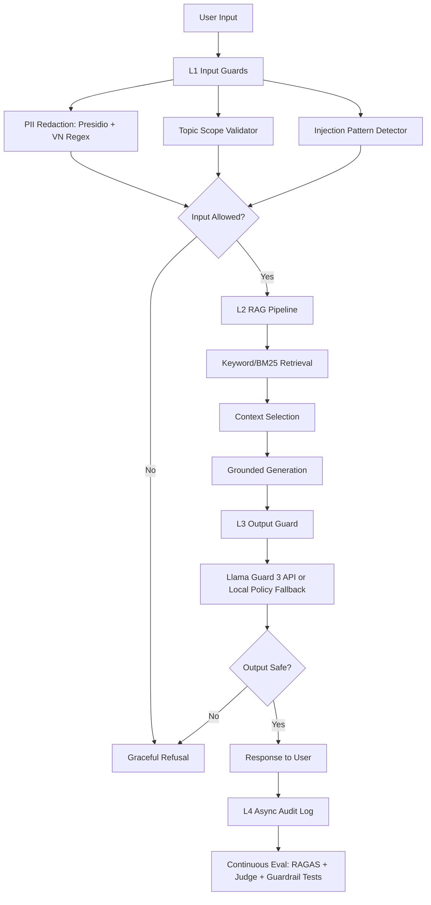

# Lab 24 Production Evaluation & Guardrail Blueprint

## System Summary

This blueprint describes a production-ready evaluation and guardrail stack for the Day 18 Vietnamese RAG pipeline. The system combines continuous RAGAS evaluation, LLM-as-Judge calibration, input/output guardrails, latency benchmarking, and incident playbooks.

Current measured results:

| Area | Result | Status |
|---|---:|---|
| RAGAS Faithfulness | 0.9556 | Excellent |
| RAGAS Answer Relevancy | 0.8437 | Excellent |
| RAGAS Context Precision | 0.9100 | Excellent |
| RAGAS Context Recall | 1.0000 | Excellent |
| Judge/Human Cohen's Kappa | 1.000 | Excellent on 10-sample calibration |
| Topic Guard Accuracy | 95% | Excellent |
| Adversarial Detection Rate | 100% | Excellent |
| Adversarial False Positive Rate | 10% | Meets lab threshold |
| L1 Input Guard P95 | 8.221 ms | Meets target < 50 ms |
| L3 Output Guard P95 | 0.651 ms | Meets target < 100 ms |
| End-to-end P95 | 9184.899 ms | Bottleneck is L2 RAG/LLM |

## Section 1: SLO Definition

| Metric | Target | Alert Threshold | Severity |
|---|---:|---:|---|
| Faithfulness | >= 0.85 | < 0.80 for 30 min | P2 |
| Answer Relevancy | >= 0.80 | < 0.75 for 30 min | P2 |
| Context Precision | >= 0.70 | < 0.65 for 1 hour | P3 |
| Context Recall | >= 0.75 | < 0.70 for 1 hour | P3 |
| Pairwise Judge Kappa | >= 0.60 | < 0.50 on weekly calibration | P3 |
| Topic Guard Accuracy | >= 0.90 | < 0.85 on regression set | P2 |
| Adversarial Detection Rate | >= 0.90 | < 0.85 on attack suite | P2 |
| False Positive Rate | <= 0.10 | > 0.15 on legitimate queries | P2 |
| L1 Input Guard P95 | < 50 ms | > 50 ms for 5 min | P2 |
| L3 Output Guard P95 | < 100 ms | > 150 ms for 5 min | P2 |
| Total Pipeline P95 | < 10 s | > 12 s for 5 min | P1 |

## Section 2: Architecture Diagram

Latency annotations from the latest benchmark:

| Layer | P50 | P95 | P99 | Notes |
|---|---:|---:|---:|---|
| L1 Input Guards | 0.970 ms | 8.221 ms | 9.858 ms | Meets target |
| L2 RAG/LLM | 8917.947 ms | 9182.817 ms | 9363.495 ms | Primary bottleneck |
| L3 Output Guard | 0.404 ms | 0.651 ms | 5.720 ms | Meets target |
| Total | 8925.605 ms | 9184.899 ms | 9365.423 ms | Dominated by L2 |

## Section 3: Alert Playbook

### Incident: Faithfulness Drops Below 0.80

**Severity:** P2

**Detection:** Continuous RAGAS evaluation on sampled production queries or nightly eval set.

**Likely causes:**

1. Prompt drift allows the LLM to answer beyond retrieved context.
2. Retrieved context has stale or unrelated chunks.
3. Corpus was updated without re-indexing.
4. Model version changed and became more verbose or speculative.

**Investigation steps:**

1. Compare faithfulness against context precision. If both dropped, inspect retrieval first.
2. Inspect the bottom 10 questions in `phase-a/failure_analysis.md`.
3. Diff the current generation prompt against the last passing version.
4. Sample 10 failed rows from `phase-a/ragas_results.csv` and check whether answer claims appear in contexts.

**Resolution:**

- Tighten prompt: "answer only from context" and refuse when evidence is missing.
- Set temperature to 0 for production RAG responses.
- Re-index corpus if documents changed.
- Roll back prompt/model version if the regression is prompt-related.

**SLO impact:** Track time to detect and time to recover. Keep incident notes attached to the failing eval run.

### Incident: Context Recall Drops Below 0.70

**Severity:** P3

**Detection:** RAGAS context recall alert from nightly or PR eval gate.

**Likely causes:**

1. Chunking changed and relevant facts are split across chunks.
2. Retrieval `top_k` is too low for multi-context questions.
3. Embedding model or vector index was not rebuilt consistently.
4. Query wording changed and dense retrieval misses Vietnamese compound words.

**Investigation steps:**

1. Filter `ragas_results.csv` for rows with context_recall < 0.70.
2. Check whether failures are mostly `multi_context` or `reasoning`.
3. Run manual retrieval for 5 failed queries and inspect top retrieved chunks.
4. Compare BM25-only, dense-only, and hybrid retrieval results.

**Resolution:**

- Increase retrieval `top_k` from 3 to 5 or 8 for multi-context queries.
- Add query decomposition for compound questions.
- Rebuild embeddings after corpus updates.
- Keep Vietnamese segmentation enabled for BM25.

**SLO impact:** Lower recall usually lowers answer relevancy later, so treat it as an early warning.

### Incident: Guardrail False Positive Rate Exceeds 15%

**Severity:** P2

**Detection:** Legitimate query regression suite or user support reports.

**Likely causes:**

1. Topic keywords are too narrow.
2. Prompt-injection regex catches harmless words.
3. Llama Guard or fallback policy over-blocks educational safety discussion.
4. Domain expanded but allowed topic list was not updated.

**Investigation steps:**

1. Inspect blocked legitimate rows in `phase-c/adversarial_test_results.csv` and audit logs.
2. Group false positives by guard layer: PII, topic, injection, output safety.
3. Check whether the query should be supported by the product scope.
4. Review exact regex or keyword that triggered the block.

**Resolution:**

- Add allowlisted domain terms for legitimate RAG/eval/guardrail queries.
- Make refusal copy graceful and specific.
- Split "unsafe instruction" from "discussion about safety systems."
- Add regression cases before changing guardrail rules.

**SLO impact:** High false positives reduce product usefulness and user trust even when safety detection is strong.

### Incident: Total P95 Latency Exceeds 12 Seconds

**Severity:** P1

**Detection:** Latency benchmark or production tracing alert.

**Likely causes:**

1. L2 generation model is slow or API latency increased.
2. Retrieval is calling external services sequentially.
3. RAGAS or judge calls accidentally run in request path.
4. Output guard API is not batched or times out.

**Investigation steps:**

1. Break down latency by L1, L2, L3 using `phase-c/latency_benchmark.csv`.
2. Confirm RAGAS/judge are offline evaluation jobs only, not synchronous user path.
3. Check OpenAI/Groq status and request timeout logs.
4. Compare cached and uncached retrieval timings.

**Resolution:**

- Cache frequent retrieval results.
- Stream generation to user if full answer latency remains high.
- Use a faster generation model for low-risk queries.
- Keep L1 and L3 parallel where possible.

**SLO impact:** Current benchmark shows L2 is the bottleneck, while guardrail overhead is below 10 ms at P95.

## Section 4: Cost Analysis

Assumption: 100,000 user queries/month.

| Component | Unit Cost Assumption | Monthly Volume | Monthly Cost |
|---|---:|---:|---:|
| RAG generation with GPT-4o-mini | $0.001/query | 100,000 | $100 |
| RAGAS continuous eval sample | $0.01/query | 1,000 | $10 |
| LLM Judge T2 tier | $0.001/query | 10,000 | $10 |
| LLM Judge T3 audit tier | $0.05/query | 1,000 | $50 |
| Presidio + regex input guard | self-hosted | 100,000 | $0 |
| Topic/injection rule guard | self-hosted | 100,000 | $0 |
| Llama Guard API or local fallback | $0.0005/query | 100,000 | $50 |
| Storage for audit logs | estimated | 100,000 | $10 |
| **Total** |  |  | **$230/month** |

### Cost Optimization Opportunities

- Evaluate only a statistically useful production sample instead of every query.
- Use the LLM judge on regressions, release candidates, and high-risk samples rather than all traffic.
- Cache retrieval and generation for repeated policy questions.
- Keep Presidio, regex guards, and topic checks self-hosted because they add minimal latency and no per-call model cost.
- Route only high-risk outputs to a stronger external guard model; use local policy checks for low-risk outputs.

## Deployment Notes

- CI gate lives in `.github/workflows/eval-gate.yml`.
- Phase A artifacts live in `phase-a/`.
- Phase B judge artifacts live in `phase-b/`.
- Phase C guardrail artifacts live in `phase-c/`.
- Evaluation and guardrail thresholds should be versioned with prompt and model changes.
